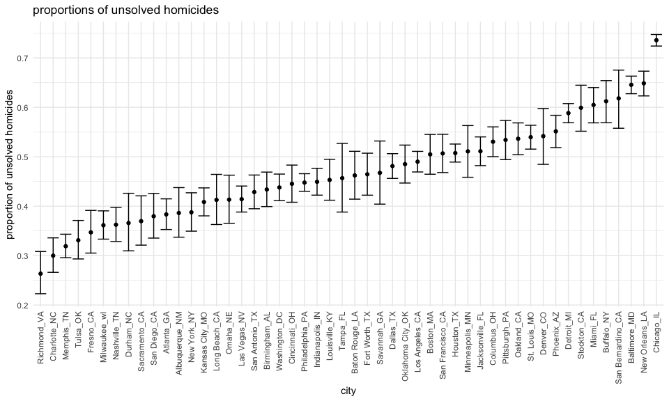
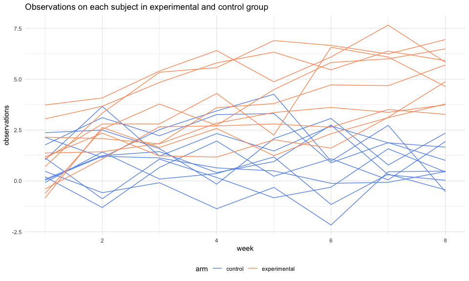
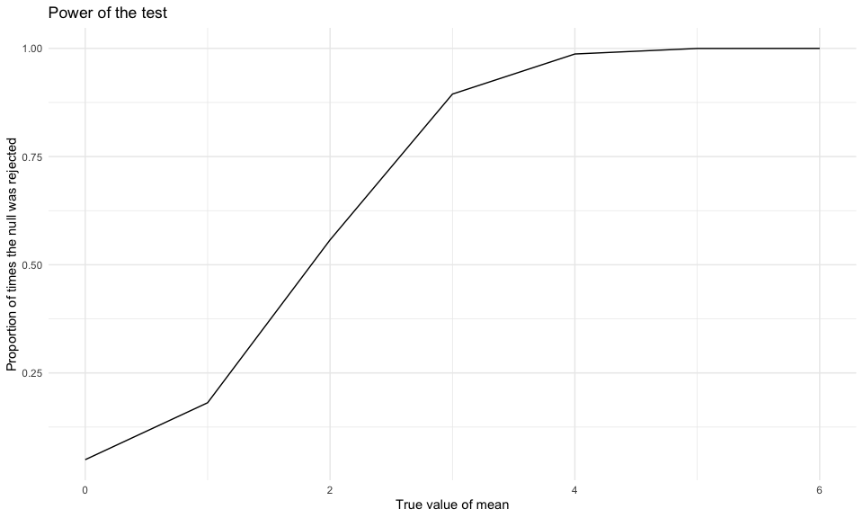
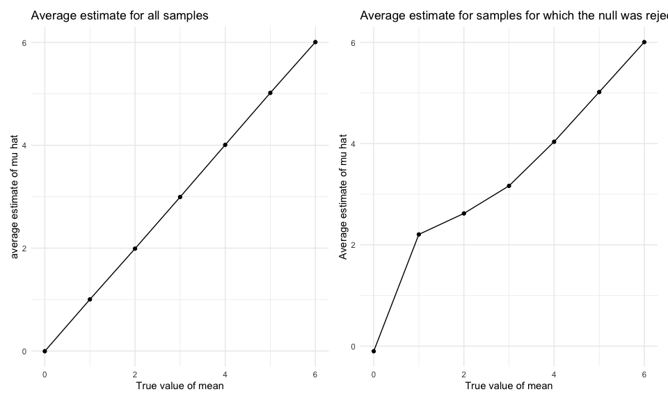

p8105\_HW05\_qx2199
================
Qianhui Xu

## Problem 1

Read in the data.

``` r
homicide_df = 
  read_csv("./homicide-data.csv") %>% 
  mutate(
    city_state = str_c(city, state, sep = "_"),
    resolved = case_when(
      disposition == "Closed without arrest" ~ "unsolved",
      disposition == "Open/No arrest"        ~ "unsolved",
      disposition == "Closed by arrest"      ~ "solved",
    )
  ) %>% 
  select(city_state, resolved) %>% 
  filter(city_state != "Tulsa_AL")
```

    ## Parsed with column specification:
    ## cols(
    ##   uid = col_character(),
    ##   reported_date = col_double(),
    ##   victim_last = col_character(),
    ##   victim_first = col_character(),
    ##   victim_race = col_character(),
    ##   victim_age = col_character(),
    ##   victim_sex = col_character(),
    ##   city = col_character(),
    ##   state = col_character(),
    ##   lat = col_double(),
    ##   lon = col_double(),
    ##   disposition = col_character()
    ## )

Let’s look at this a bit

``` r
aggregate_df = 
  homicide_df %>% 
  group_by(city_state) %>% 
  summarize(
    hom_total = n(),
    hom_unsolved = sum(resolved == "unsolved")
  )
```

    ## `summarise()` ungrouping output (override with `.groups` argument)

Can I do a prop test for a single city?

``` r
prop.test(
  aggregate_df %>% filter(city_state == "Baltimore_MD") %>% pull(hom_unsolved), 
  aggregate_df %>% filter(city_state == "Baltimore_MD") %>% pull(hom_total)) %>% 
  broom::tidy()
```

    ## # A tibble: 1 x 8
    ##   estimate statistic  p.value parameter conf.low conf.high method    alternative
    ##      <dbl>     <dbl>    <dbl>     <int>    <dbl>     <dbl> <chr>     <chr>      
    ## 1    0.646      239. 6.46e-54         1    0.628     0.663 1-sample… two.sided

Try to iterate ……..

``` r
results_df = 
  aggregate_df %>% 
  mutate(
    prop_tests = map2(.x = hom_unsolved, .y = hom_total, ~prop.test(x = .x, n = .y)),
    tidy_tests = map(.x = prop_tests, ~broom::tidy(.x))
  ) %>% 
  select(-prop_tests) %>% 
  unnest(tidy_tests) %>% 
  select(city_state, estimate, conf.low, conf.high)
```

``` r
problem_1 =
results_df %>% 
  mutate(city_state = fct_reorder(city_state, estimate)) %>% 
  ggplot(aes(x = city_state, y = estimate)) +
  geom_point() + 
  geom_errorbar(aes(ymin = conf.low, ymax = conf.high)) + 
  theme(axis.text.x = element_text(angle = 90, vjust = 0.5, hjust = 1))+
  labs( title = "proportions of unsolved homicides", x = "city", y = "proportion of unsolved homicides" )

problem_1
```



## Problem 2

import and tidy dataset.

``` r
problem_2_df = 
  tibble(files = list.files(path = "./data",full.names = TRUE)) %>% 
  mutate(file_contents = map(.x = files, ~read_csv(.x))) %>% 
  unnest(file_contents) %>% 
   pivot_longer(
    week_1:week_8,
    names_to = "week",
    names_prefix = "week_",
    values_to = "observations"
  ) %>% 
  mutate(files = str_replace(files, ".csv$", "")) %>% 
  mutate(files = str_replace(files, "con", "control"),
         files = str_replace(files, "exp", "experimental")) %>% 
  separate(files, into = c("arms_old", "id"), sep = "\\_") %>%   
  separate(arms_old,into=c("dot","data","arm"), sep ="/") %>%
  select(-dot,-data) %>% 
  mutate(id = as.numeric(id), arm = as.factor(arm), week = as.numeric(week)) %>% 
  relocate(arm, id)
```

    ## Parsed with column specification:
    ## cols(
    ##   week_1 = col_double(),
    ##   week_2 = col_double(),
    ##   week_3 = col_double(),
    ##   week_4 = col_double(),
    ##   week_5 = col_double(),
    ##   week_6 = col_double(),
    ##   week_7 = col_double(),
    ##   week_8 = col_double()
    ## )
    ## Parsed with column specification:
    ## cols(
    ##   week_1 = col_double(),
    ##   week_2 = col_double(),
    ##   week_3 = col_double(),
    ##   week_4 = col_double(),
    ##   week_5 = col_double(),
    ##   week_6 = col_double(),
    ##   week_7 = col_double(),
    ##   week_8 = col_double()
    ## )
    ## Parsed with column specification:
    ## cols(
    ##   week_1 = col_double(),
    ##   week_2 = col_double(),
    ##   week_3 = col_double(),
    ##   week_4 = col_double(),
    ##   week_5 = col_double(),
    ##   week_6 = col_double(),
    ##   week_7 = col_double(),
    ##   week_8 = col_double()
    ## )
    ## Parsed with column specification:
    ## cols(
    ##   week_1 = col_double(),
    ##   week_2 = col_double(),
    ##   week_3 = col_double(),
    ##   week_4 = col_double(),
    ##   week_5 = col_double(),
    ##   week_6 = col_double(),
    ##   week_7 = col_double(),
    ##   week_8 = col_double()
    ## )
    ## Parsed with column specification:
    ## cols(
    ##   week_1 = col_double(),
    ##   week_2 = col_double(),
    ##   week_3 = col_double(),
    ##   week_4 = col_double(),
    ##   week_5 = col_double(),
    ##   week_6 = col_double(),
    ##   week_7 = col_double(),
    ##   week_8 = col_double()
    ## )
    ## Parsed with column specification:
    ## cols(
    ##   week_1 = col_double(),
    ##   week_2 = col_double(),
    ##   week_3 = col_double(),
    ##   week_4 = col_double(),
    ##   week_5 = col_double(),
    ##   week_6 = col_double(),
    ##   week_7 = col_double(),
    ##   week_8 = col_double()
    ## )
    ## Parsed with column specification:
    ## cols(
    ##   week_1 = col_double(),
    ##   week_2 = col_double(),
    ##   week_3 = col_double(),
    ##   week_4 = col_double(),
    ##   week_5 = col_double(),
    ##   week_6 = col_double(),
    ##   week_7 = col_double(),
    ##   week_8 = col_double()
    ## )
    ## Parsed with column specification:
    ## cols(
    ##   week_1 = col_double(),
    ##   week_2 = col_double(),
    ##   week_3 = col_double(),
    ##   week_4 = col_double(),
    ##   week_5 = col_double(),
    ##   week_6 = col_double(),
    ##   week_7 = col_double(),
    ##   week_8 = col_double()
    ## )
    ## Parsed with column specification:
    ## cols(
    ##   week_1 = col_double(),
    ##   week_2 = col_double(),
    ##   week_3 = col_double(),
    ##   week_4 = col_double(),
    ##   week_5 = col_double(),
    ##   week_6 = col_double(),
    ##   week_7 = col_double(),
    ##   week_8 = col_double()
    ## )
    ## Parsed with column specification:
    ## cols(
    ##   week_1 = col_double(),
    ##   week_2 = col_double(),
    ##   week_3 = col_double(),
    ##   week_4 = col_double(),
    ##   week_5 = col_double(),
    ##   week_6 = col_double(),
    ##   week_7 = col_double(),
    ##   week_8 = col_double()
    ## )
    ## Parsed with column specification:
    ## cols(
    ##   week_1 = col_double(),
    ##   week_2 = col_double(),
    ##   week_3 = col_double(),
    ##   week_4 = col_double(),
    ##   week_5 = col_double(),
    ##   week_6 = col_double(),
    ##   week_7 = col_double(),
    ##   week_8 = col_double()
    ## )
    ## Parsed with column specification:
    ## cols(
    ##   week_1 = col_double(),
    ##   week_2 = col_double(),
    ##   week_3 = col_double(),
    ##   week_4 = col_double(),
    ##   week_5 = col_double(),
    ##   week_6 = col_double(),
    ##   week_7 = col_double(),
    ##   week_8 = col_double()
    ## )
    ## Parsed with column specification:
    ## cols(
    ##   week_1 = col_double(),
    ##   week_2 = col_double(),
    ##   week_3 = col_double(),
    ##   week_4 = col_double(),
    ##   week_5 = col_double(),
    ##   week_6 = col_double(),
    ##   week_7 = col_double(),
    ##   week_8 = col_double()
    ## )
    ## Parsed with column specification:
    ## cols(
    ##   week_1 = col_double(),
    ##   week_2 = col_double(),
    ##   week_3 = col_double(),
    ##   week_4 = col_double(),
    ##   week_5 = col_double(),
    ##   week_6 = col_double(),
    ##   week_7 = col_double(),
    ##   week_8 = col_double()
    ## )
    ## Parsed with column specification:
    ## cols(
    ##   week_1 = col_double(),
    ##   week_2 = col_double(),
    ##   week_3 = col_double(),
    ##   week_4 = col_double(),
    ##   week_5 = col_double(),
    ##   week_6 = col_double(),
    ##   week_7 = col_double(),
    ##   week_8 = col_double()
    ## )
    ## Parsed with column specification:
    ## cols(
    ##   week_1 = col_double(),
    ##   week_2 = col_double(),
    ##   week_3 = col_double(),
    ##   week_4 = col_double(),
    ##   week_5 = col_double(),
    ##   week_6 = col_double(),
    ##   week_7 = col_double(),
    ##   week_8 = col_double()
    ## )
    ## Parsed with column specification:
    ## cols(
    ##   week_1 = col_double(),
    ##   week_2 = col_double(),
    ##   week_3 = col_double(),
    ##   week_4 = col_double(),
    ##   week_5 = col_double(),
    ##   week_6 = col_double(),
    ##   week_7 = col_double(),
    ##   week_8 = col_double()
    ## )
    ## Parsed with column specification:
    ## cols(
    ##   week_1 = col_double(),
    ##   week_2 = col_double(),
    ##   week_3 = col_double(),
    ##   week_4 = col_double(),
    ##   week_5 = col_double(),
    ##   week_6 = col_double(),
    ##   week_7 = col_double(),
    ##   week_8 = col_double()
    ## )
    ## Parsed with column specification:
    ## cols(
    ##   week_1 = col_double(),
    ##   week_2 = col_double(),
    ##   week_3 = col_double(),
    ##   week_4 = col_double(),
    ##   week_5 = col_double(),
    ##   week_6 = col_double(),
    ##   week_7 = col_double(),
    ##   week_8 = col_double()
    ## )
    ## Parsed with column specification:
    ## cols(
    ##   week_1 = col_double(),
    ##   week_2 = col_double(),
    ##   week_3 = col_double(),
    ##   week_4 = col_double(),
    ##   week_5 = col_double(),
    ##   week_6 = col_double(),
    ##   week_7 = col_double(),
    ##   week_8 = col_double()
    ## )

``` r
problem_2_df
```

    ## # A tibble: 160 x 4
    ##    arm        id  week observations
    ##    <fct>   <dbl> <dbl>        <dbl>
    ##  1 control     1     1         0.2 
    ##  2 control     1     2        -1.31
    ##  3 control     1     3         0.66
    ##  4 control     1     4         1.96
    ##  5 control     1     5         0.23
    ##  6 control     1     6         1.09
    ##  7 control     1     7         0.05
    ##  8 control     1     8         1.94
    ##  9 control     2     1         1.13
    ## 10 control     2     2        -0.88
    ## # … with 150 more rows

##### Q2.1Make a spaghetti plot showing observations on each subject over time, and comment on differences between groups.

``` r
problem_2_plot=
problem_2_df %>%
  ggplot(aes(x = week, y = observations, group = interaction(id,arm),color=arm))  +scale_color_manual(values=c("#6495ED","#FF9966"))+
  geom_line() + labs(  title = "Observations on each subject in experimental and control group ",x = "week", y = "observations")
problem_2_plot
```



##### Q2.2Comment on differences between groups.

We found that at week 1,the observed values in the control group and the
experimental group are similar. During the following weeks we can see
that there’s an increasing trend in the observed values in the
experimental group, while in the control group,the observed value seems
to vary between -2.5 and 5. There’s not a increasing/decreasing trend,
and the trend seems to be relatively stable for the observed values in
the control group. We could see that the difference of the ovserved
values in the two groups become larger after 8 weeks. The overall
observed values in the experimental group is higher than that in the
control group after 8 weeks following-up.

## Problem 3

``` r
set.seed(1)
```

Create the function

``` r
problem_3 = function(n = 30, mu, sigma = 5) 
  {
  sim_data = tibble(
    x = rnorm(n, mean = mu, sd = sigma)
  )
 sim_data %>% 
    summarize(
      mu_hat = mean(x),
      t.test(x, mu = 0, conf.level = 0.95) %>% 
      broom::tidy() %>% 
      select(p.value))
}
```

Run the function 5000 times, obtain the dataset of interest when mu=0

``` r
output_mu = vector("list", 5000)
for (i in 1:5000) {
  output_mu[[i]] = problem_3(mu = 0) 
 }
 sim_results = bind_rows(output_mu)
```

Create the dataset which contains the values we want when mu ranges from
0 to 6

``` r
sim_mu_final = 
  tibble( mu = 0:6) %>% 
  mutate(
    output_mu_other = map(.x = mu, ~rerun (5000, problem_3(mu = .x))),
    other_mu_df = map(output_mu_other, bind_rows)
  ) %>% 
  select(-output_mu_other) %>% 
  unnest(other_mu_df) 
```

``` r
sim_mu_final %>% 
  mutate( mu = as.factor(mu))
```

    ## # A tibble: 35,000 x 3
    ##    mu    mu_hat p.value
    ##    <fct>  <dbl>   <dbl>
    ##  1 0      0.520   0.549
    ##  2 0      1.11    0.188
    ##  3 0      1.01    0.220
    ##  4 0     -0.835   0.309
    ##  5 0     -0.892   0.365
    ##  6 0      0.557   0.503
    ##  7 0      1.04    0.238
    ##  8 0      1.40    0.144
    ##  9 0      1.15    0.180
    ## 10 0     -0.500   0.634
    ## # … with 34,990 more rows

##### Q3.1.1 Make a plot showing the proportion of times the null was rejected on the y axis and the true value of mean on the x axis

``` r
plot_one  =
sim_mu_final  %>% 
  group_by(mu) %>%
  mutate(outcome = ifelse(p.value < 0.05, "reject", "not reject") )%>% 
  summarize(num_reject = sum ( outcome == "reject"),num_total= n()) %>% 
  mutate(rejection_proportion = num_reject / num_total ) %>% 
ggplot(aes(x = mu, y = rejection_proportion, fill = mu)) + geom_line() +labs(title = "Power of the test",x = "True value of mean",y = "Proportion of times the null was rejected")
```

    ## `summarise()` ungrouping output (override with `.groups` argument)

``` r
plot_one
```



##### Q3.1.2 Describe the association between effect size and power.

From the plot, we could see that as the effect size increases, the
proportion of times that the null was rejected also increases, which
indicates that the power increases as our effect size increases. The
power is relative high, which approximate to 1 when the true values of
mean equal to 4,5,and 6 when the effect size is relatively large.

##### Q3.2 Make a plot showing the average estimate of μ hat on the y axis and the true value of μ on the x axis. Make a second plot (or overlay on the first) the average estimate of μ hat only in samples for which the null was rejected on the y axis and the true value of μ on the x axis.

``` r
plot_two =
  sim_mu_final  %>% 
  group_by(mu) %>% 
  summarize(average_mu_hat = mean(mu_hat)) %>% 
  ggplot(aes(x = mu, y = average_mu_hat)) +
  geom_point() + geom_line() +
  labs(
    title = "Average estimate for all samples",
    x = "True value of mean",
    y = "average estimate of mu hat"
  )
```

    ## `summarise()` ungrouping output (override with `.groups` argument)

``` r
plot_three = 
  sim_mu_final  %>% 
  group_by(mu) %>% 
  filter(p.value < 0.05) %>% 
  summarize(average_mu_hat_three = mean(mu_hat)) %>% 
  ggplot(aes(x = mu, y = average_mu_hat_three)) + geom_point() + geom_line() +labs(
    title = "Average estimate for samples for which the null was rejected",
    x = "True value of mean",
    y = "Average estimate of mu hat"
  )
```

    ## `summarise()` ungrouping output (override with `.groups` argument)

``` r
plot_two + plot_three
```



##### Q3.3 Is the sample average of μ hat across tests for which the null is rejected approximately equal to the true value of μ? Why or why not?

Firstly, from the left plot we could see that the estimated mean equals
to the true value of mean,because the dataset is normal distributed and
follows central limit theorem.

From the plot two and plot three we could see that when μ, the true
value of mean = 0,4,5,6, the the sample average of μ̂ across tests for
which the null is rejected approximately equal to the true mean value ;

  - Specifically,when true value of mean = 0, the power is relatively
    low, and given that the values that we reject are always randomly
    distributed above or below 0, the estimated mean for these values
    will also approximate to 0.

  - Also,when true value of mean = 4,5,6, the powers are relatively high
    which approximate to 1 and nearly all the tests reject the null.
    Therefore, the average estimated mean will be similar or very
    approximate to the true mean value.

From the plot two and plot three we could also see that when μ, the true
value of mean = 1,2,3 the the sample average of μ hat across tests for
which the the null is rejected is higher than the true mean value.

  - Specifically,when true value of mean = 1,2,3, under this scenario,
    power is relatively higher than true value of mean = 0 but is still
    not high enough. Samples on the left of the distribution (smaller
    means) will not reject the null while most of the samples which is
    larger than estimated mean will reject the null hypothesis, the
    average estimated mean will be higher than the true mean value.
